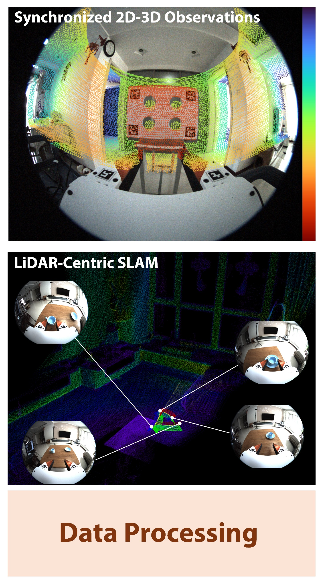
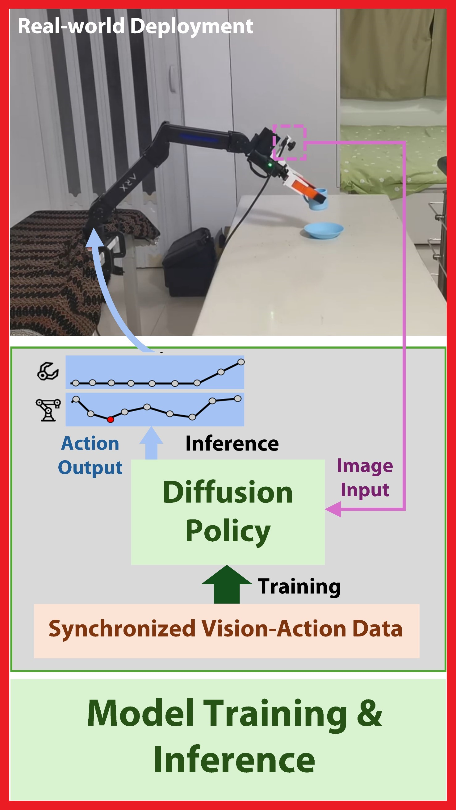
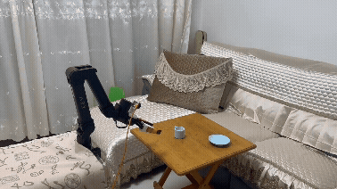
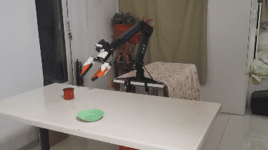

# UMI-3D Policy Training and Deployment

<div align="center">
<h3>
  🌐 <a href="https://umi-3d.github.io/">UMI-3D Project Homepage</a>
</h3>

<table>
  <tr>
    <td align="center" width="33%">
      <a href="https://github.com/Physical-Intelligence-Laboratory/UMI-3D-Hardware">
        <b>🔧 UMI-3D Hardware</b>
      </a>
    </td>
    <td align="center" width="33%">
      <a href="https://github.com/hku-mars/UMI-3D">
        <b>🛰️ UMI-3D SLAM Pipeline</b>
      </a>
    </td>
    <td align="center" width="33%">
      <a href="https://github.com/Physical-Intelligence-Laboratory/UMI-3D-Policy">
        <b>🤖 UMI-3D Policy</b>
      </a>
    </td>
  </tr>

  <tr>
    <td align="center">
      <a href="https://github.com/Physical-Intelligence-Laboratory/UMI-3D-Hardware">
        
      </a>
    </td>
    <td align="center">
      <a href="https://github.com/hku-mars/UMI-3D">
        
      </a>
    </td>
    <td align="center">
      <a href="https://github.com/Physical-Intelligence-Laboratory/UMI-3D-Policy">
        
      </a>
    </td>
  </tr>

  <tr>
    <td align="center">
      Hardware design, BOM, CAD, 3D-print parts
    </td>
    <td align="center">
      SLAM, synchronization, calibration, and data processing
    </td>
    <td align="center">
      Policy training, deployment, inference<br><br>
      <a href="https://github.com/Physical-Intelligence-Laboratory/UMI-3D-Dataset">
        <b>📦 Dataset & Models</b>
      </a>
    </td>
  </tr>
</table>

</div>

## 0. Dataset Preparation

The training data for UMI-3D Policy must be prepared using the official UMI-3D data processing pipeline, which includes sensor calibration, SLAM-based trajectory estimation, multimodal alignment, and dataset packaging.

Please refer to the following repository for detailed instructions:

👉 https://github.com/hku-mars/UMI-3D

This pipeline converts **raw rosbag recordings** into **training-ready datasets** (e.g., Zarr format).

After completing the data preparation, you should obtain a dataset file such as:

```bash
DATASET_NAME.zarr.zip
```

## 1. Policy Training

### 1.1 Install environment

**System dependencies**
```bash
sudo apt install -y libosmesa6-dev libgl1-mesa-glx libglfw3 patchelf
```

**Conda environment**

We recommend using [Miniforge](https://github.com/conda-forge/miniforge) instead of the standard Anaconda distribution.

```bash
cd umi_3d_training
mamba env create -f conda_environment.yaml
conda activate umi
```
### 1.2 Training Diffusion Policy

Single-GPU training. Tested to work on RTX3090 24GB.
```console
(umi)$ WANDB_DISABLED=true python train.py --config-name=train_diffusion_unet_timm_umi_workspace task.dataset_path=example_demo_session/dataset.zarr.zip
```

Multi-GPU training.
```console
(umi)$ WANDB_DISABLED=true accelerate --num_processes <ngpus> train.py --config-name=train_diffusion_unet_timm_umi_workspace task.dataset_path=example_demo_session/dataset.zarr.zip
```
> **Note:**  
> The default visual encoder is `vit_base_patch16_clip_224.openai`.  
> Users can optionally switch to larger models by setting `policy.obs_encoder.model_name`, such as:
> - `vit_large_patch14_clip_224.openai`  
> - `vit_base_patch14_dinov2.lvd142m`  
> - `vit_large_patch14_dinov2.lvd142m`  
>
> These larger encoders generally provide stronger visual representations but require significantly more GPU memory.  
> Please adjust `dataloader.batch_size` accordingly, and consider enabling mixed precision training (e.g., `--mixed_precision=bf16`) based on your hardware capacity.

## 2. Real-world Deployment

### 2.1 Diffusion Policy Setup

Download a example trained checkpoint from:
https://github.com/Physical-Intelligence-Laboratory/UMI-3D-Dataset. Put it into `/detached-umi-policy/data/models`

Start the policy inference server:
```
cd detached-umi-policy
conda activate umi

python detached_policy_inference.py \
  -i data/models/MODEL_NAME.ckpt
```
When you see: `PolicyInferenceNode is listening on 0.0.0.0:8766` the inference server is ready. Keep it running in the background.

### 2.2 ARX5 Robot Arm Controller Setup
Power on the ARX5 robot arm and connect it to the host via USB-CAN.

> **Important**: Ensure the gripper is in a closed state before first startup.

The following setup applies to ARX L5 / R5.
For X5, replace L5_umi with X5_umi.

```
cd arx5-sdk

# Create environment
mamba env create -f conda_environments/py310_environment.yaml
conda activate arx-py310

# Install controller interface
pip install arx5-interface

# Setup CAN communication
sudo udevadm control --reload-rules && sudo udevadm trigger
sudo slcand -o -f -s8 /dev/arxcan0 can0
sudo ifconfig can0 up

# Start controller server
python python/communication/zmq_server.py L5_umi can0
```
The server will run at: `0.0.0.0:8765` If no commands are received for 60 seconds, the robot will return to a safe passive state to prevent overheating.

### 2.3 UMI-3D Minimal Deployment (ARX + Hikrobot Camera)
#### Step 1 — Hardware Setup
Follow the hardware assembly instructions: https://github.com/Physical-Intelligence-Laboratory/UMI-3D-Hardware

- Mount the UMI gripper and Hikrobot fisheye camera on the ARX arm
- Connect the camera via USB 3.0

You can configure camera parameters (exposure, frame rate, white balance, etc.) in: `config/left_camera_trigger.yaml`

#### Step 2 — Camera Driver Setup
Install MVS SDK: https://github.com/bitcat-tech/MVS_V3.0.1

Build the C++ camera server using the system toolchain (not conda):
```
conda deactivate

cd umi-arx-hik/cpp/hik_camera
rm -rf build_sys
mkdir build_sys
cd build_sys

cmake .. \
  -DBUILD_PYTHON_MODULE=OFF \
  -DBUILD_TEST_MAIN=OFF \
  -DBUILD_HIK_SERVER=ON \
  -DCMAKE_C_COMPILER=/usr/bin/gcc \
  -DCMAKE_CXX_COMPILER=/usr/bin/g++ \
  -DOpenCV_DIR=/usr/lib/x86_64-linux-gnu/cmake/opencv4

make -j
```
This should generate: `cpp/hik_camera/build_sys/hik_server`

#### Step 3 — Run Deployment Script
```
cd umi-arx-hik
mamba env create -f umi_arx_environment.yaml
conda activate umi-arx

mkdir -p data/experiments

python scripts/eval_arx5_hik.py \
  -i YOUR_PATH_TO/detached-umi-policy/data/models/MODEL_NAME.ckpt \
  -o data/experiments/DATE
```

<div align="center">
  
  
</div>

## Acknowledgements

This project builds upon several outstanding open-source efforts in embodied intelligence and robotic manipulation, including 
[UMI](https://github.com/real-stanford/universal_manipulation_interface), 
[UMI-on-Legs](https://github.com/real-stanford/umi-on-legs), 
[arx5-sdk](https://github.com/real-stanford/arx5-sdk), and 
[umi-arx](https://github.com/real-stanford/umi-arx). We sincerely thank the authors and contributors of these projects for their pioneering work and valuable open-source contributions, which have significantly inspired and enabled the development of UMI-3D.